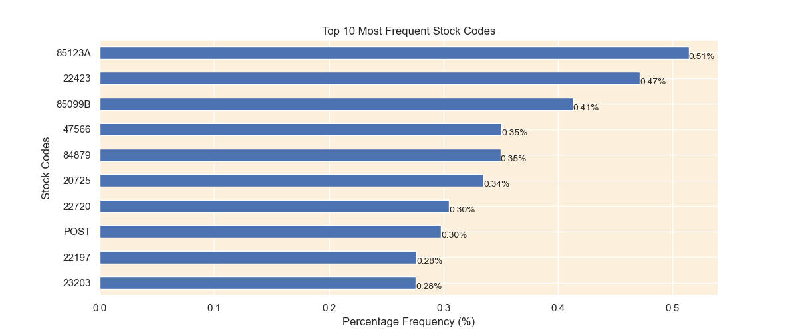

# 🧠 Customer Segmentation Using K-Means Clustering

This project demonstrates how unsupervised machine learning can be applied to real-world retail data to identify customer segments and support targeted marketing strategies. We use the K-Means clustering algorithm to uncover hidden patterns in purchasing behavior.

---

## 📁 Dataset

The dataset contains customer details such as:
- Age
- Annual Income (k$)
- Spending Score (1–100)

Sourced from an open dataset, each row represents a unique customer with numeric attributes ideal for clustering.

---

## 🛠️ Tools & Technologies

- Python (Jupyter Notebook)
- Libraries: `pandas`, `numpy`, `matplotlib`, `seaborn`, `scikit-learn`
- Algorithms: K-Means Clustering, PCA

---

## 📊 Project Workflow

1. **Data Cleaning & EDA**
   - Removed null values and duplicates
   - Visualized data distributions and correlations

2. **Feature Engineering**
   - Selected key attributes: Age, Income, and Spending Score
   - Created visual summaries and distribution plots

3. **Clustering**
   - Used Elbow Method to identify optimal clusters
   - Applied K-Means algorithm
   - Visualized clusters with PCA

4. **Insights**
   - Identified five distinct customer types
   - Supported segmentation-based recommendations

---

## 📸 Visual Results

## 📊 Bar Chart Analysis

## 🔍 Cluster Overview

.png)

### 🧬 Correlation Heatmap

### 🟦 Histogram

### 📈 Distribution Plot

### ⚠️ Outlier Detection

### 🔝 Top 30 Purchased Items

---

## 🧾 Key Takeaways

- Clustering can reveal meaningful customer personas
- Visual analytics improves interpretability of ML models
- This approach enables data-driven marketing strategies

---

## ✅ Future Improvements

- Integrate demographic & behavioral data
- Deploy a Streamlit-based dashboard
- Extend to real-time segmentation with incoming sales data

---

## 🤝 Let's Connect

If you found this project interesting or have suggestions, feel free to connect with me on [LinkedIn]:  www.linkedin.com/in/fahim-ahmad-a31571213

 or explore more projects on [GitHub]:  https://github.com/fahim-29/Customer-Segmentation-Project/edit/main/README.md

